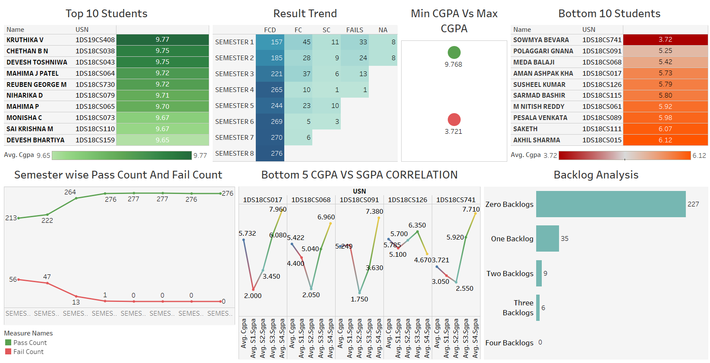

# 🎓 Result Analysis Dashboard (Tableau)

This project showcases a comprehensive result analysis dashboard built using Tableau. It visualizes student performance across semesters and subjects, highlighting key insights like toppers, bottom performers, pass/fail trends, and backlog distribution.

---

## 📂 Project Overview

The data was originally scattered across **multiple PDF files** with inconsistent formatting. I consolidated all the relevant records into a **single Excel file**, performed **data cleaning and transformation**, and used **calculated fields** and **interactive filters** in Tableau to create meaningful visualizations.

---

## 📊 Dashboard Features

### 🔹 Top & Bottom 10 Students
- Based on CGPA, sorted to show the best and least performers.
- Uses color gradients for easy comparison.

### 🔹 Result Trend (Semester-wise)
- Displays the count of different result categories like FCD, FC, SC, FAIL, and NA.
- Allows tracking how result quality changed across semesters.

### 🔹 CGPA vs SGPA Correlation
- Shows detailed SGPA progression of bottom 5 students.
- Helps identify recovery/improvement trends.

### 🔹 Pass vs Fail Count (Semester-wise)
- Visual trend of overall class performance across semesters.

### 🔹 Backlog Analysis
- Categorizes students by number of backlogs.
- Gives insight into academic support areas.

---

## 🧪 Data Preparation

- 📌 Extracted data from multiple PDFs manually.
- 🧹 Cleaned and standardized using Excel (removed duplicates, unified formats).
- 🧮 Created calculated fields in Tableau (e.g., average CGPA, SGPA trends).
- 🔍 Applied filters, color encodings, and tooltips for interactivity.

---

## 📁 Files Included

- `Result_Analysis_Dashboard.twbx` — Tableau packaged workbook (with structure only, no sensitive data)
- `dashboard.png` — Preview image of the final dashboard
- `source_data.xlsx` — Cleaned Excel data file (optional, remove if sensitive)

---

## 🚀 How to View

1. Download the `.twbx` file.
2. Open it using [Tableau Public (Free)](https://public.tableau.com/s/download) or Tableau Desktop.
3. Use the filters and visual elements to explore the insights.

---

## 📌 Key Tools Used

- **Tableau** (Calculated Fields, Filters, Maps, Charts)
- **Excel** (Data Cleaning, Consolidation)
- **PDF to Excel Tools** (for raw extraction)

---

## 🔐 Data Privacy

> 🛡️ This dashboard is based on **anonymized or dummy academic data**. No personally sensitive student data is shared publicly. The real data used internally has been removed from this version.

---

## 📷 Preview

---
## 📽️ Project Presentation

A detailed PDF presentation covering:
- Project background
- Data extraction and cleaning
- Dashboard walkthrough
- Insights and conclusions

📄 [Click here to view the PDF](Result analysis(1).pdf)

## ✍️ Author

**Aditya BG**  
3rd Year CSE Student — Dayananda Sagar College of Engineering  
Email: adityabg11@gmail.com 

---

